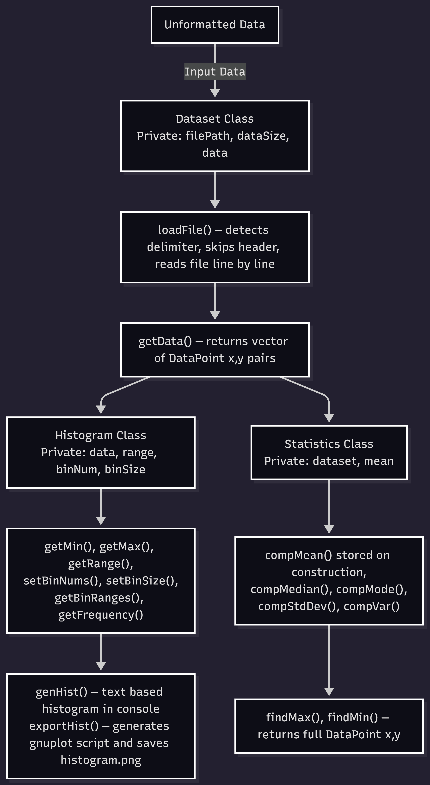

# Statistical Analysis and Histogram Generator

## Team Members
- Krish Dhamala
- Daniel Gutierrez
- Hue Gomatam

## Project Overview
A C++ application that reads numerical datasets from `.csv` or `.txt` files and performs 
statistical analysis and histogram generation. The histogram is automatically exported 
and visualized using gnuplot, with the output image saved to the `images/` folder.

## Main Functionalities
- **Dataset Loading** — Reads `.csv` or `.txt` files and stores data as (x, y) pairs
- **Statistics Calculator** — Computes mean, median, mode, standard deviation, variance, min, and max
- **Histogram Generator** — Generates a text-based histogram in the console
- **Histogram Export** — Exports histogram data and automatically plots it using gnuplot, saving the image to `images/histogram.png`

## System Design


## OOP Design Summary
| Class | Responsibility |
|-------|---------------|
| `Dataset` | Loads and stores data from file as (x,y) DataPoints |
| `Histogram` | Computes bin ranges, frequencies, and exports to gnuplot |
| `Statistics` | Computes statistical measures from the dataset |

## Tools and Technologies
- C++ (C++17)
- gnuplot 6.0
- WSL Ubuntu
- VS Code

## Folder Structure
```
Project/
│
├── README.md
├── docs/
│   └── System_Design_Overview.pdf
├── pseudocode/
│   └── pseudocode.txt
├── src/
│   ├── main.cpp
│   ├── Dataset.h
│   ├── Dataset.cpp
│   ├── Histogram.h
│   ├── Histogram.cpp
│   ├── StatsCalc.h
│   └── StatsCalc.cpp
├── tests/
│   ├── test.csv
│   └── README_tests.md
└── images/
    ├── system_diagram.png
    └── histogram.png
```

## How to Run
**Dependencies:**
```bash
sudo apt-get install gnuplot
```

**Compile:**
```bash
g++ main.cpp Dataset.cpp Histogram.cpp StatsCalc.cpp -o main
```

**Run:**
```bash
./main
```

## Test Cases
A sample test dataset is provided in the `tests/` folder to verify program functionality.

| File | Description |
|------|-------------|
| `tests/test.csv` | Simple distribution dataset with 20 data points |

To run with the test dataset, update the file path in `main.cpp`:
```cpp
ds.loadFile("tests/test.csv");
```
Expected outputs and explanations for each test case are documented in `tests/README_tests.md`.

## What Has Been Implemented
- Full `Dataset` class with CSV/TXT file loading
- Full `Statistics` class with all statistical computations
- Full `Histogram` class with text-based display and gnuplot export
- Automatic gnuplot visualization saved to `images/histogram.png`

## Project Goals
- Provide a simple tool for analyzing time-series or waveform datasets
- Display statistical summaries clearly in the console
- Generate publication-quality histogram images automatically